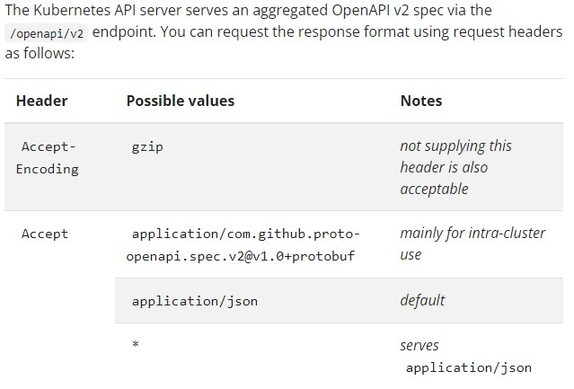
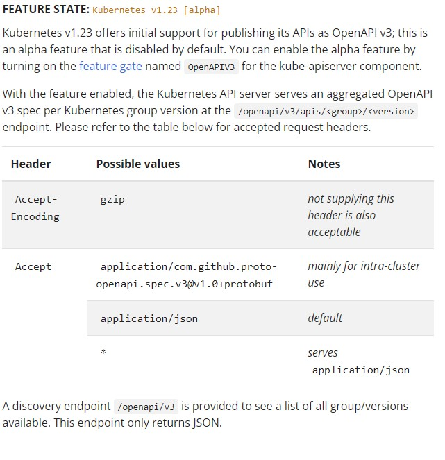

# Kubernetes Concepts

Portable, extensible, open-source platform for managing containerized workloads and services, facilitating declarative configuration and automation.

## Inhoudstafel

- [Kubernetes Concepts](#kubernetes-concepts)
  - [Inhoudstafel](#inhoudstafel)
  - [What is kubernetes](#what-is-kubernetes)
  - [Componenten van K8s](#componenten-van-k8s)
    - [Controle plane componenten](#controle-plane-componenten)
    - [Node Components](#node-components)
    - [Addons](#addons)
  - [The kubernetes API](#the-kubernetes-api)
    - [OpenAPI spec](#openapi-spec)
    - [Persistence](#persistence)
    - [API groups and versioning](#api-groups-and-versioning)
  - [Working with Kubernetes Objects](#working-with-kubernetes-objects)

## What is kubernetes

- **Service discovery and load balancing**  
  kan docker containers exposen using DNS name of met het eigen IP adres. als container hoog network traffic experienced gaat kubernetes load balancen over het netwerk zodat deployment stable blijft
- **Storage orchestration**  
  Automatisch mounten van storage systems of your choice, zoals local storage, public cloud providers, ..
- **Automated rollouts and rollbacks**  
  automation: k8s kan vb containers aanmaken voor deployment, alsook verwijderen en vrijgekomen resources dynamisch aan andere containers terug geven.
- **Automatic bin packing**  
  meegeven met kubernetes welke nodes het kan gebruiken (fysieke/cloud servers), zegt hoeveel cpu en ram elke container nodig heeft en k8s zet zelf de nodes vol met containers -> best use of resources
- **Self healing**  
  containers die failen worden automatisch herstart, containers worden vervangen, non-responsive containers die niet voldoen aan user-defined health check. K8s served enkel ready containers & services aan de klant, geen non-responsive of kapotte.
- **Secret and configuration management**  
  store & manage sensitie info, passwords, OAuth tokens, SSH keys, ... update secrest & application config zonder container images te rebuilden

## Componenten van K8s

  

  nodes zijn de worker machines/servers die de containerized apps echt runnen. Elke K8s cluster heeft minstens 1 node.

### Controle plane componenten

- **Kube-apiserver**
  - frontend, exposes kubernetes API
  - scales horizontally, als traffic teveel wordt word er nieuwe instance opgezet
- **etcd**
  - highly-available key value store used as backing store voor alle cluster data
  - oppassen, zien dat er backup plan in werking is
- **kube-scheduler**
  - watches for newly created pods with no assigned node, and selects node for them to run on.
  - verschillende factors taken into account:
    - individueel & collectieve resource requirements
    - hardware,software,policy constraints
    - affinity & anti-affinity specs, data locality, ...
- **kube-controller-manager**
  - runs controller processes
  - elke controller is logisch gezien een apart proces, maar ze zijn voor complexiteitsredenen combined in single binary & run in a single proces.
  - enkele types controllers:
    - node controller: noticing & responding als nodes down gaan
    - job controller: kijken naar job objects dat one-off tasks representen, pods createn en tasks to completion runnen
    - endpoints controller: populates Endpoints object (join services & pods)
    - service account & token controllers: creeert default accounts & API access tokens voor nieuwe namespaces
- **cloud-controller-manager**  
link de cluster aan het cloud platform. Runt enkel controllers die specifiek aan jouw specifiek aan de cloud provider waar je bij zit. In een on prem of learning env is er dus geen cloud-controller-manager
  - controllers die cloud provider dependenies kunnen hebben:
    - node controller: checking cloud provider to determine if node has been deleted in the cloud after it stops responding
    - route controller: setting up routers in underlying cloud infra
    - service controller: for creating, updating and deleting cloud provider load balancers

### Node Components

- kubelet: agent die op elke node in een cluster runt. makes sure dat containers in een Pod runnen.
  - takes et of PodSpecs provided door verschillende mechanisms en zorgt ervoor dat containers correct volgens spec runnen en gezond zijn.
- kube-proxy: network proxy dat op elke node in de cluster runned, implementing part of k8s service concept
- container runtime: software responsible for running containers, container runtimes kunnen zijn containerd, CRI-O, ...

### Addons

- DNS: cluster DNS, elke container gestart door kubernetes is automatisch included in DNS searches
- Web UI (dashboard)
- Container Resource Monitoring
- Cluster-level logging: logging van elke container kan gecentraliseerd worden in central log store, met search/browsing interface

## The kubernetes API

http API exposed aan iedereen, hierdoor kan alles met elkaar communiceren. 

### OpenAPI spec

- V2  
  

- V3  
  

### Persistence

k8s stores serialized state of objects by writing them into etcd

### API groups and versioning

Als er modules, controllers, ... van verschillende versies communiceren met de centrale API, worden deze onzichtbaar vertaald zodat de centrale API laag dit snapt.

De API kan dus continu groeien en veranderen. Het doel is compatibiliteit niet te doen breken met existing clients naarmate er nieuwere versies beschikbaar zijn.

## Working with Kubernetes Objects