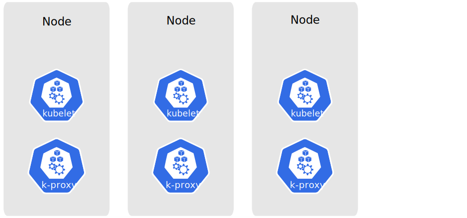
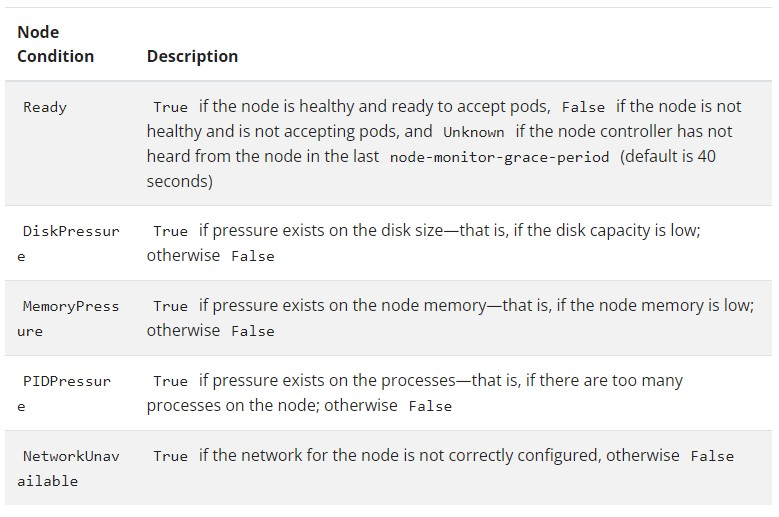
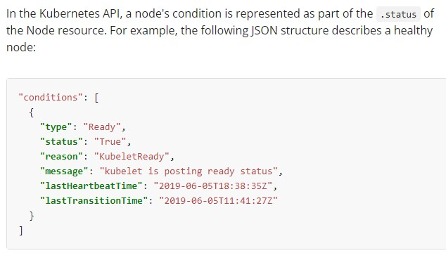

# Cluster Architecture

pod: een set van running containers die hetzelfde draaien (vb webserver is de pod, met 4 replikas)

## Nodes

### Management

Nodes kunnen op 2 manieren geadd worden aan een API server / kubernetes cluster:

1. De Kubelet op een node gaat zichzelf registreren bij de control plane
2. Een gebruiker add de Node zichzelf

node names moeten uniek zijn, er kunnen er geen meerdere dezelfde naam hebben.

Om een kubelet te laten auto registreren bij een api server, gaat deze de `--register-node=true` optie moeten hebben.  
Ook wordt kubelet opgestart met volgende opties:

- `--kubeconfig` -> pad naar creds voor zich te kunnen auth. bij API server
- `--cloud-provider` -> hoe praten met cloud provider om metadata over zichzelf te lezen
- `--register-node` -> automatisch registeren
- `--register-with-taints` -> node registeren met lijst van *taints (naam voor key=value:effect)*
- `--node-ip` -> ip address of node
- `--node-labels` -> tags die tot deze node betrekking hebben, worden geadd aan deze node bij registratie aan cluster
- `--node-status-update-frequency` -> specifieerd hoevaak kubelet node status aan master doorgeeft

### Node Status

https://kubernetes.io/docs/concepts/architecture/nodes/#node-status 

commando:  
`kubectl describe node nodeNaam`

**Addresses**
The usage of these fields varies depending on your cloud provider or bare metal configuration.

- HostName: The hostname as reported by the node's kernel. Can be overridden via the kubelet `--hostname-override` parameter.
- ExternalIP: Typically the IP address of the node that is externally routable (available from outside the cluster).
- InternalIP: Typically the IP address of the node that is routable only within the cluster

**Conditions**

**Capacity and Allocatable**

Describes the resources available on the node: CPU, memory, and the maximum number of pods that can be scheduled onto the node.

The fields in the capacity block indicate the total amount of resources that a Node has. The allocatable block indicates the amount of resources on a Node that is available to be consumed by normal Pods.

You may read more about capacity and allocatable resources while learning how to reserve compute resources on a Node.

Info
Describes general information about the node, such as kernel version, Kubernetes version (kubelet and kube-proxy version), container runtime details, and which operating system the node uses. The kubelet gathers this information from the node and publishes it into the Kubernetes API.

### Heartbeats

worden verstuurd door nodes. Zo kan master van cluster de availability berekenen/estimaten van elke node, en actie taken als er failures/geen heartbeat optreden.

2 soorten heartbeats:

- updates naar de .status van een node
- Lease objects within the kube-node-lease namespace. Each Node has an associated Lease object. 

### Node Controller

Control plane component dat various node aspects managed.

verschillende rollen:

1. CIDR block toewijzen aan nieuwe node als die zich registreerd
2. node controller node list up to date met de cloud provider lijst van available machines. *When running in a cloud environment and whenever a node is unhealthy, the node controller asks the cloud provider if the VM for that node is still available. If not, the node controller deletes the node from its list of nodes.*
3. monitoren van nodes' health
   - als node unreachable is, NodeReady condition in .status veranderen naar ConditionUnknown
   - als node unreachable blijft, API initiated eviction triggeren voor alle pods met unreachable node. Dat wilt zeggen dat alle services/containers die runnende zijn op de node(s) die unreachable zijn worden gekilled. Is meestal 5min na de conditionUnknown stap.

---

## Control Plane-node communication

k8s is een Hub&Spoke API patroon. alles komt toe in centrale API server. alle andere services op de control plane zijn niet gebouwd om connecties open te stellen naar buitenaf, alles gaat langs de API server.

Dus ook nodes passeren deze api server. Node to apiserver conns defaulten naar HTTP connections, dus niet authenticated of encrypted. De connections kunnen met `https:` ook over https traffic gestuurd worden. Er kunnen ook 

---

## Controllers

---

## Cloud Controller Manager

---

## Container Runtime Interface

---

## Garbage Collection
