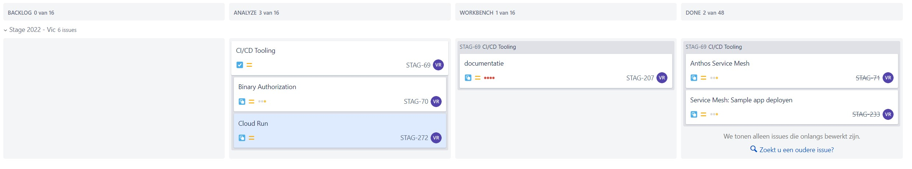

# Logboek: Week 12

Hierin vermeld ik dagelijks wat ik heb gedaan, waaraan ik heb gewerkt, welke zaken er afgewerkt zijn of niet.

Er is dagelijks een Standup met de stagementor en andere stagaires, dus dit vermeld ik niet telkens opnieuw.

Vanaf week 2 word ik op een Jira bord geplaatst waar we in kanban vorm verder werken aan de opdrachten. Ik zal dan wekelijks dit bord delen en hier in dit logboek zetten. Als ik ondervind dat dit te onduidelijk is vul ik dit nog aan.

---

### **Maandag**

done - doing:

- [x] Demo stagebezoek 3 (online) gemaakt & gegeven
- [ ] stageverslag verder schrijven

to do:

---

### **Dinsdag**

done - doing:

- [ ] Service mesh: enkele zaken nog uitproberen, het deployen van meerdere applicaties op de service mesh
- [ ] 

to do:

- ..
- ..

---

### **Woensdag**

done - doing:

- [ ] CI/CD Tools: Cloud Run documentatie bekijken
- [ ] Bachelorproef
to do:

- ..
- ..

---

### **Donderdag**

done - doing:

- [ ] CI/CD Tools: Cloud Run documentatie bekijken
- [ ] Bachelorproef

to do:

- ..
- ..

---

### **Vrijdag**

BP Dag

---
