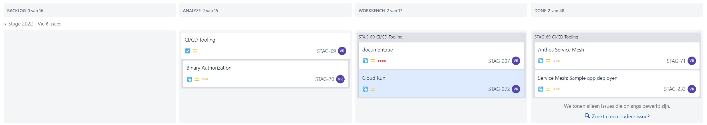

# Logboek: Week 13

Hierin vermeld ik dagelijks wat ik heb gedaan, waaraan ik heb gewerkt, welke zaken er afgewerkt zijn of niet.

Er is dagelijks een Standup met de stagementor en andere stagaires, dus dit vermeld ik niet telkens opnieuw.

Vanaf week 2 word ik op een Jira bord geplaatst waar we in kanban vorm verder werken aan de opdrachten. Ik zal dan wekelijks dit bord delen en hier in dit logboek zetten. Als ik ondervind dat dit te onduidelijk is vul ik dit nog aan.

---

### **Maandag**

done - doing:

- [x] CI/CD Tools: Cloud Run documentatie bekijken
- [ ] Bachelorproef

---

### **Dinsdag**

done - doing:

- [ ] Stageverslag verwerken 
- [ ] Cloud Run extra functionaliteit 

---

### **Woensdag**

done - doing:

- [x] Cloud Run: Extra functionaliteit, CI/CD systeem adhv Github Action en Cloud Run opgezet.
- [x] Demo gegeven
- [x] Presentatie bijgewerkt

---

### **Donderdag**

done - doing:

- [x] Binary Authorization afgewerkt
- [x] Stageopdracht volledig afgewerkt

Er is afgesproken met stagebegeleider en project manager dat ik me volgende week volledig focus op mijn bachelorproef.

---

### **Vrijdag**

BP Dag

---
