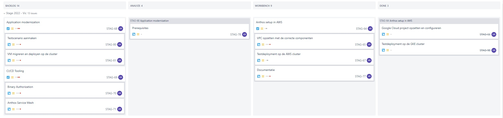

# Logboek: Week 3

Hierin vermeld ik dagelijks wat ik heb gedaan, waaraan ik heb gewerkt, welke zaken er afgewerkt zijn of niet.

Er is dagelijks een Standup met de stagementor en andere stagaires, dus dit vermeld ik niet telkens opnieuw.

Vanaf week 2 word ik op een Jira bord geplaatst waar we in kanban vorm verder werken aan de opdrachten. Ik zal dan wekelijks dit bord delen en hier in dit logboek zetten. Als ik ondervind dat dit te onduidelijk is vul ik dit nog aan.

---

### **Maandag**

done - doing:

- [x] Google Credentials verkregen, Google Cloud Project is aangemaakt
- [x] K8s cluster aangemaakt in Gcloud
- [x] Testdeployment (kleine hello-world app) in cluster gedeployed.
- [ ] Troubleshooting over aws cluster deployment met Anthos (cluster wordt deployed maar is niet zichtbaar in Anthos/Gcloud)

to do:

- Testdeployment op AWS cluster deployen.

---

### **Dinsdag**

done - doing:

- [ ] troubleshooting over aws cluster deployment met anthos (nog steeds fouten bij creatie cluster)
- [ ] Installatie AWS VPC en dergelijke automatiseren met powershell

to do:

- Testdeployment op AWS cluster deployen.
- ..

---

### **Woensdag**

done - doing:

- [x] Grotere Testdeployment GKE Cluster in Anthos
- [ ] Start documentatie en opzoekwerk App Modernization

to do:

- Troubleshooting voortzetten, wachten op hulp van stagementor.
- ..

---

### **Donderdag**

done - doing:

- [x] Troubleshooting Anthos AWS Cluster
- [x] Issue opgesteld en aangemaakt voor Google Cloud support
- [ ] App modernization: eerste testen gedaan

to do:

- Demo klaarmaken voor woensdag
- ..

---

### **Vrijdag**

BP Dag

---
