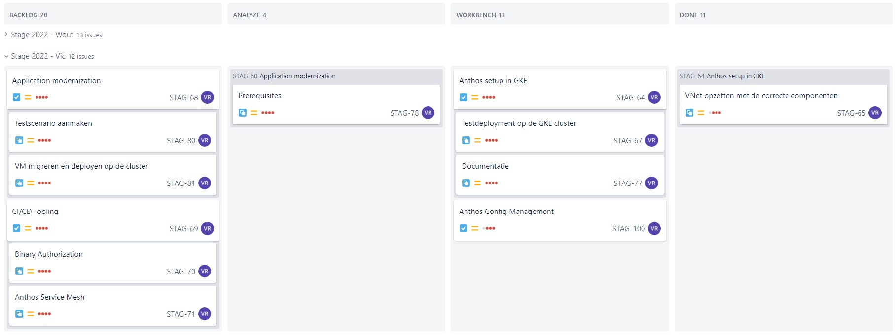

# Logboek: Week 5

Hierin vermeld ik dagelijks wat ik heb gedaan, waaraan ik heb gewerkt, welke zaken er afgewerkt zijn of niet.

Er is dagelijks een Standup met de stagementor en andere stagaires, dus dit vermeld ik niet telkens opnieuw.

Vanaf week 2 word ik op een Jira bord geplaatst waar we in kanban vorm verder werken aan de opdrachten. Ik zal dan wekelijks dit bord delen en hier in dit logboek zetten. Als ik ondervind dat dit te onduidelijk is vul ik dit nog aan.

---

### **Maandag**

done - doing:

- [x] Troubleshooting

to do:

- ..

---

### **Dinsdag**

Hogent Job Event

---

### **Woensdag**

done - doing:

- [ ] Troubleshooting op de Anthos Azure cluster

to do:

- ..

---

### **Donderdag**

done - doing:

- [ ] Troubleshooting op de Anthos Azure Cluster
- [x] Verdere uitwerking Policies & constraints voor de Anthos Config Management

to do:

- ..

---

### **Vrijdag**

BP Dag

---
