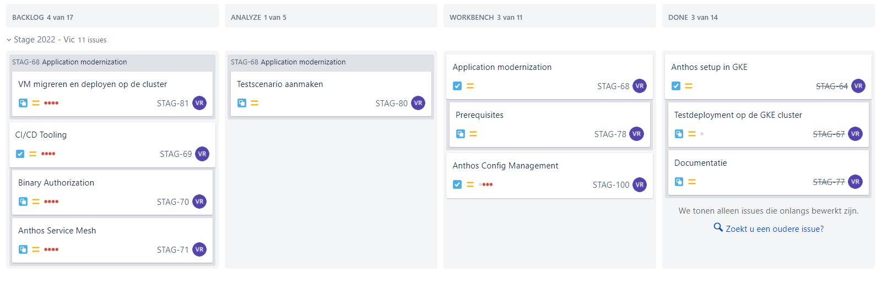

# Logboek: Week 6

Hierin vermeld ik dagelijks wat ik heb gedaan, waaraan ik heb gewerkt, welke zaken er afgewerkt zijn of niet.

Er is dagelijks een Standup met de stagementor en andere stagaires, dus dit vermeld ik niet telkens opnieuw.

Vanaf week 2 word ik op een Jira bord geplaatst waar we in kanban vorm verder werken aan de opdrachten. Ik zal dan wekelijks dit bord delen en hier in dit logboek zetten. Als ik ondervind dat dit te onduidelijk is vul ik dit nog aan.

---

### **Maandag**

done - doing:

- [x] troubleshooting
- [x] Meeting met Glenn, beslissen hoe de stageopdracht verder wordt afgewerkt. Morgen valt hier een definitieve beslissing over.

to do:

- ..
- ..

---

### **Dinsdag**

Door de vaststelling dat er teveel issues boven water komen bij het initialiseren van een Anthos Cluster op een ander cloud platform (AWS en Azure), zijn we geneigd om de opdracht te hervormen naar enkel Google Cloud Clusters. Zo kan ik toch de volledige opdracht uitwerken zonder al het extra troubleshooting & fixes die nodig zijn. Er is een support ticket aangemaakt die Glenn zal opvolgen.

done - doing:

- [x] Troubleshooting klaar. Clustercreation is een stukje gelukt, maar er komen teveel issues boven. We switchen naar GKE clusters om de opdracht verder te kunnen zetten.
- [ ] Stageverslag aangemaakt. Ik heb hier al een eerste stuk tekst in geschreven, over het bedrijf.
- [ ] Config management voortzetten, verschillende policies & constraints aanmaken en uitdiepen.

to do:

- Overzichtje voor Demo maken.
- ..

---

### **Woensdag**

done - doing:

- [x] Demo gepresenteerd
- [x] Overzicht voor demo gemaakt
- [ ] Config management voortzetten, het proberen integreren van zelfgeschreven policies & constraints

to do:

- Starten aan app. modernization

---

### **Donderdag**

done - doing:

- [x] Config management afgewerkt
- [ ] Opzoekwerk Migration For Anthos

to do:

- Testscenario voor migration uitwerken
- Stageverslag verder schrijven

---

### **Vrijdag**

BP Dag

---
